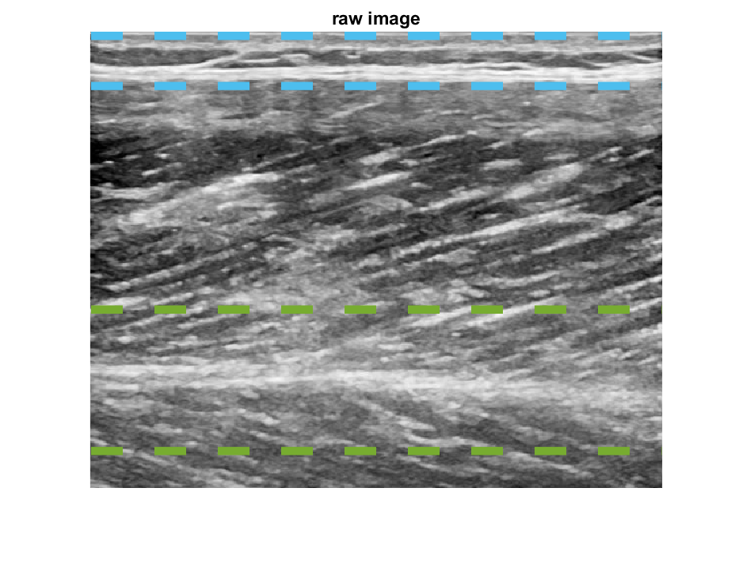
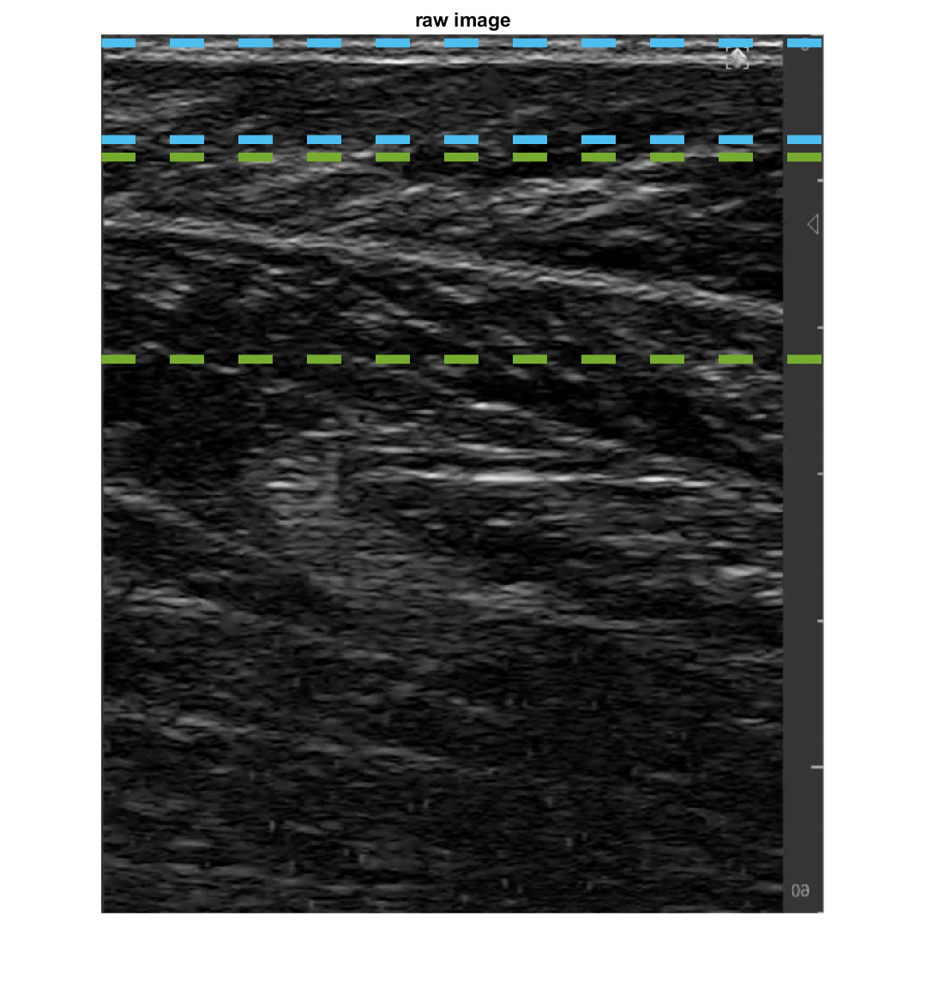

# Ultrasound-automated-algorithm

This respository includes code that can be used to estimate muscle fascicle lengths and pennation angles from muscle ultrasound images. The algorithm uses a combination of Frangi filtering, Hough transform and machine learning (support vector machine, SVM). 

This algorithm has been used for determination of fascicle lengths during isometric knee torque production, see: https://www.biorxiv.org/content/10.1101/2020.08.23.263574v1

In addition, it has been used to estimate muscle work and its associated energetic cost during cyclic torque production, see: https://www.biorxiv.org/content/10.1101/2020.08.25.266965v1

## Main function: auto_ultrasound.m
[alpha, betha, thickness] = auto_ultrasound(data,parms)

**Inputs**

* data: needs to be a m-by-n numeric array specifying grayscale intensities, saved in .mat format. Fascicle angle needs to be within the range 0-90 deg with the positive horinzontal, pointing to the right. Depending on your specific image, you may need to flip about the vertical axis. For an example of flipping, reading and converting images to .mat, see *Data\convert_png_to_mat.m*
* parms: struct specifying the parameters used in the algorithm, with fields fas and apo

**Outputs**

* alpha: fascicle angle with the horizontal (degrees)
* betha: superficial aponeurosis angle with horizontal (degrees)
* thickness: perpendicular distance between superficial- and deep aponeurosis (pixels)

**Outputs may be used to determine pennation angle (phi) and fascicle length (faslen):**
* phi = alpha - betha;
* faslen = thickness ./ sind(phi);

## Example scripts: example.m and example_live.mlx

Both scripts run auto_ultrasound.m on example image(s)

**Example.m**: script that loads parameters stored in *parms.mat*, which are suited for example data *example_ultrasound_image.mat*

**Example_live.mlx**: live script that facilitates updating parameter values and investigate their effect

An important parameter is parms.apo.deepcut, which specifies the region of interest for the deep aponeurosis. This region may differ quite substantially between images.
In some images (e.g. Data\example_ultrasound_image.mat), the deep aponeurosis is near the bottom of the image. In other images (e.g. Data\example_ultrasound_image3.mat), the deep aponeurosis is in the middle of the image. The region of interest is specified with an upper and lower limit, shown as dashed horizontal lines in the example images below. Note that these two different images have very different values for parms.apo.deepcut

## Folders

**Filter**

* *filter_usimage.m*: main filter function which calls on several Frangi filter functions created by Dirk-Jan Kroon (https://www.mathworks.com/matlabcentral/fileexchange/24409-hessian-based-frangi-vesselness-filter)

**Aponeurosis**

* *retrain_SVM.m*: example script for retraining the SVM model using the function *train_apo_SVM.m* and example data *example_ultrasound_video.mat*

* *train_apo_SVM.m*: function for retraining SVM model using the labelling function *get_labeled_data.m* 

* *get_labeled_data.m*: manually labels images (correct/incorrect) with assigned properties using function *get_apo_props.m*

* *get_apo_props.m*: extract certain properties from aponeurosis objects that are used by SVM 

* *get_apo_obj.m*: finds aponeurosis object given data and SVM model

* *apo_func.m*: finds the aponeurosis vector given aponeurosis object

**Hough**

* *dohough.m*: executes MATLABs hough transform function (https://www.mathworks.com/help/images/ref/hough.html) and uses a weighted average of the most frequently occuring angles in the image to estimate fascicle angle (i.e. with the horizontal)

* *ComputeAndDisplayHoughTransformExample.m*: adapted version of MATLABs example for using their hough transform function on a build-in image ('gantrycrane.png') (see: https://www.mathworks.com/help/images/ref/hough.html). Adapted to allow for visualizing lines and playing with the npeaks parameter that sets the amount of extracted lines. 

**Parameters**: contains default parameters *parms.mat* and a script to create these *default_parms.m*

**Data**: contains example data

*example_ultrasound_image*
* Muscle: Vastus Lateralis
* Ultrasound device: General Electric Logiq E9
* Facility: University of Calgary, Canada
* Investigator: Tim van der Zee

*example_ultrasound_image2*
* Muscle: Vastus Lateralis
* Ultrasound device: Telemed LVD8-4L65S-3
* Facility: University of Verona, Italy
* Investigator: Paolo Tecchio

*example_ultrasound_image3*
* Muscle: Gastrocnemius Medialis
* Ultrasound device: Telemed LVD8-4L65S-3
* Facility: University of Verona, Italy
* Investigator: Paolo Tecchio

For questions, please email me: tim.vanderzee@ucalgary.ca
