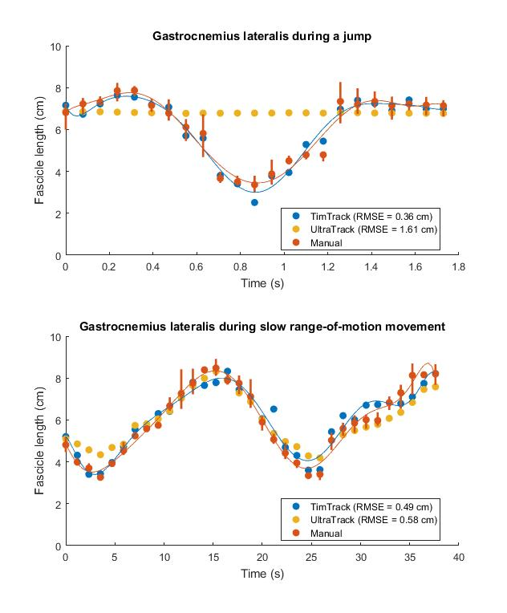

# TimTrack: A drift-free algorithm for estimating geometric muscle features from ultrasound images

This respository contains MATLAB-based code that can be used to estimate muscle fascicle length, muscle thickness and pennation angle from muscle ultrasound images. The so-called TimTrack-algorithm uses a combination of Frangi-type vessel enhancement filtering to highlight line-like structures and Hough transform to obtain the overall fascicle orientation.

This algorithm is described in more detail in our [bioRxiv pre-print](https://www.biorxiv.org/content/10.1101/2020.08.23.263574v2) and has been used to estimate the mechanical work done by muscle fascicles during cyclic contraction in a [peer-reviewed study](https://journals.biologists.com/jeb/article-abstract/224/9/jeb233965/237823/The-high-energetic-cost-of-rapid-force-development?redirectedFrom=fulltext).

## Overview
The main function is called **auto_ultrasound**, which requires a grayscale ultrasound image (*ultrasound_image*) and parameters (*parms*) as inputs and outputs geometric muscle features (*geofeatures*) and (optionally) aponeurosis vectors (*apovecs*). Geometric muscle features included:
* Fascicle length
* Pennation angle
* Muscle thickness

The inputs and outputs of the **auto_ultrasound** are explained below under "Main function: auto_ultrasound.m". As an example, **auto_ultrasound** may be ran on example images using default parameters by evaluating the script **example.m**. 

Note: before **auto_ultrasound** can be ran on any new ultrasound image, the raw image needs to be processed and parameters may need to be adjusted. An example of how to process a raw image is shown in **process_ultrasound_image**; an example of how the parameters can be adjusted is shown in the live script **adjust_ultrasound_parameters**. Parameters should only be set once for an entire series of images, allowing rapid image analysis (~ 1s per image with an 'avenrage' processor). In our [bioRxiv pre-print](https://www.biorxiv.org/content/10.1101/2020.08.23.263574v2), we used the same set of parameters on our entire data set, which includes images from two different muscles (gastrocnemius lateralis and vastus lateralis), three different movements (isometric contraction, jumping and range-of-motion), from nine different human subjects. An example of using the same set of parameters on a series of ultrasound images is also shown in **example.m**. If the image series is in chronological order and captured at moderate-to-high rates (i.e. ~5 Hz or higher), we recommend low-pass filtering the time-series to reduce random noise. Similarly, aponeurosis vectors (*apovecs*) may be interpolated post-hoc using **correct_aponeuroses**, which we recommend for image sequences with occlusion (e.g. due to probe losing contact with skin).

**Figure: Gastrocnemius lateralis during jump.** Fitted superficial aponeurosis (blue), deep aponeurosis (green) and representative fascicle (red solid). Pixels that contribute to the representative are shown in red-white colors, with redder colors contributing more than whiter colors. Dashed red line indicates the elipsoid region for fascicle detection

## Main function: auto_ultrasound.m
[geofeatures, apovecs] = auto_ultrasound(ultrasound_image,parms)

**Inputs**

* ultrasound_image: needs to be a m-by-n numeric array specifying grayscale intensities, saved in .mat format. Fascicle angle needs to be within the range 0-90 deg with the rightward pointing horinzontal. Depending on your specific image, you may need to flip about the vertical axis. For an example of processing raw images (incl. flipping, reading, cutting, converting), see **process_ultrasound_image**.
* parms: struct specifying the parameters used in the algorithm, with fields fas and apo for fascicle and aponeuroses respectively. For an example on how to adjust parameters, see the live script **adjust_ultrasound_parameters**.

**Outputs**

* geofeatures: struct containing geometric muscle features, including fascicle angle with the horizontal in degrees (*alpha*), superficial aponeurosis angle with horizontal in degrees (*betha*) and perpendicular distance between superficial- and deep aponeurosis in pixels (*thickness*). Pennation angle (*phi*) and fascicle length (*faslen*) may be determined from *alpha*, *betha* and *thickness* using trigonometry:
  * phi = alpha - betha;
  * faslen = thickness ./ sind(phi);
* apovecs: vectors containing the sampled points on the aponeurosis object, which may be post-hoc processed using **correct_aponeuroses**.

## Core functions: filter_usimage, apo_func and dohough

* *filter_usimage.m*: main filter function which calls on several Frangi filter functions created by Dirk-Jan Kroon (https://www.mathworks.com/matlabcentral/fileexchange/24409-hessian-based-frangi-vesselness-filter), and detects aponeurosis objects.

* *apo_func.m*: main aponeurosis selection function, which samples points on the inner edge of the aponeurosis object (*apo_obj*) and outputs these in a vector (*apo_simple*)

* *dohough.m*: executes MATLABs hough transform function (https://www.mathworks.com/help/images/ref/hough.html) and uses the median of the most frequently occuring angles in the image to estimate fascicle angle (i.e. with the horizontal)

## Parameters

Contains default parameters *parms.mat* and a script to create these *default_parms.m*. Parameters specific to a certain image can be created through running  **adjust_ultrasound_parameters**, which saves its output in this folder. For example "parms_for_example_ultrasound_image.mat" contains the parameters specific to the image "example_ultrasound_image".

## Example images

**Single_images**
Contains the following single images:

*example_ultrasound_image*
* Muscle: Vastus Lateralis
* Ultrasound device: General Electric Logiq E9
* Facility: University of Calgary, Canada
* Investigator: Tim van der Zee

*example_ultrasound_image2*
* Muscle: Vastus Lateralis
* Ultrasound device: Telemed LVD8-4L65S-3
* Facility: University of Verona, Italy
* Investigator: Paolo Tecchio

*example_ultrasound_image3*
* Muscle: Gastrocnemius Medialis
* Ultrasound device: Telemed LVD8-4L65S-3
* Facility: University of Verona, Italy
* Investigator: Paolo Tecchio

*example_ultrasound_image4*
* Muscle: Gastrocnemius Lateralis
* Ultrasound device: General Electric Logiq E9
* Facility: University of Calgary, Canada
* Investigator: Tim van der Zee

**Video**
Contains image sequences (i.e. "video") collected by Tim van der Zee on Gastrocnemius Lateralis using General Electric Logiq E9 at University of Calgary, Canada. These images were collected at 30 Hz and downsampled to fit GitHubs file size limits. The estimated geometric muscle features are compared to estimates from manual observers, and to estimates from a state-of-the-art optic flow algorithm called **UltraTrack** (see [bioRxiv pre-print](https://www.biorxiv.org/content/10.1101/2020.08.23.263574v2) for more detail). Note: UltraTrack estimates were performed on the original data (30 Hz), and estimates were downsampled. Manual estimates and TimTrack estimates were performed on the downsampled data. 

**Figure: TimTrack vs. manual vs. UltraTrack for gastrocnemius lateralis during jump and slow range-of-motion movement**

## Contact
The code has been tested for MATLAB versions 2016a and 2020a. I aim to make it compatible with other versions as well in the future. Please let me know if you run into issues with your MATLAB version and I can make adjustments. 

For questions, please email me: tim.vanderzee@ucalgary.ca
