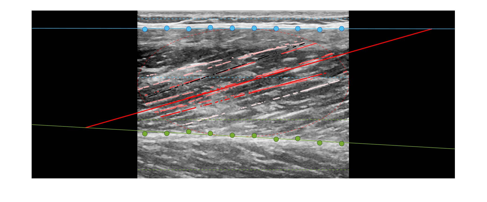

# TimTrack: A drift-free algorithm for estimating geometric muscle features from ultrasound images

This respository contains MATLAB-based code that can be used to estimate muscle fascicle length, muscle thickness and pennation angle from muscle ultrasound images. 
The so-called TimTrack-algorithm uses a combination of image filtering to highlight line-like structures and line-detection procedures to obtain the overall fascicle orientation.

This algorithm is described in more detail in our [bioRxiv pre-print](https://www.biorxiv.org/content/10.1101/2020.08.23.263574v2) 
and has been used to estimate the mechanical work done by muscle fascicles during cyclic contraction in a [peer-reviewed study](https://journals.biologists.com/jeb/article-abstract/224/9/jeb233965/237823/The-high-energetic-cost-of-rapid-force-development?redirectedFrom=fulltext).

## Overview
The main function is called **auto_ultrasound.m**, which may be called directly, or indirectly through calling **do_TimTrack.m**. Both these functions need two inputs: (1) the ultrasound image and (2) algorithm parameters (*parms*). 
Both functions output geometric muscle features (*geofeatures*), including:

* Fascicle length
* Pennation angle
* Muscle thickness

**do_TimTrack** is more forgiving than **auto_ultrasound**, and is designed to handle multiple input types. For example, **do_TimTrack** can take the image filename as input, read in the raw image or image sequence
and do some pre-processing before calling **auto_ultrasound**.
In contrast, **auto_ultrasound** requires a (cropped) grayscale image formtatted as a 2-dimensional MATLAB matrix where all pixels corresponding to measured data (i.e. echo reflection intensity). 
As an example, the TimTrack algorithm may be ran on example images using default parameters by evaluating the script **example.m**. 

## Adjusting parameters
The **adjust_ultrasound_parameters.mlx** live script allows changing parameter values and directly testing their effect on a chosen image.

## Visualization
TimTrack can optionally show a figure of the analyzed image, which can optionally be saved. Here is an example of such a figure:

**Figure: Vastus lateralis during isometric contraction.** Fitted superficial aponeurosis (blue), deep aponeurosis (green) and representative fascicle (red solid). Pixels that contribute to the representative are shown in red-white colors, with redder colors contributing more than whiter colors. Dashed red line indicates the elipsoid region for fascicle detection

If the parms.makeGIF parameter is true, **do_TimTrack.m** calls on **gif.m** to create a GIF of the analysis. **gif.m** and associated functions are developed by [Chad Greene](https://www.chadagreene.com/).
Here is an example of such a GIF: 

**Figure: Gastrocnemius lateralis during jump.** Fitted superficial aponeurosis (blue), deep aponeurosis (green) and representative fascicle (red solid). Pixels that contribute to the representative are shown in red-white colors, with redder colors contributing more than whiter colors. Dashed red line indicates the elipsoid region for fascicle detection

## Core functions: filter_usimage, apo_func and dohough

* *filter_usimage.m*: main filter function which calls on several Frangi filter functions created by [Dirk-Jan Kroon](https://www.mathworks.com/matlabcentral/fileexchange/24409-hessian-based-frangi-vesselness-filter), and detects aponeurosis objects.

* *apo_func.m*: main aponeurosis selection function, which samples points on the inner edge of the aponeurosis object (*apo_obj*) and outputs these in a vector (*apo_simple*)

* *dohough.m*: executes [MATLABs hough transform function](https://www.mathworks.com/help/images/ref/hough.html) and uses the weighted median of the most frequently occuring angles in the image to estimate fascicle angle (i.e. with the horizontal). TimTrack uses a weighted median function developed by [Sven Haase](https://www.mathworks.com/matlabcentral/fileexchange/23077-weighted-median).

## Example images
Several example images are included in the "example images" folder.

## Open Source License
All TimTrack software is available under the CC0-1.0 License (see License file). Images from [Drazan's repository](https://zenodo.org/record/2598553#.Ygvcrt_MJD8)
 and [Seyness's repository](https://data.mendeley.com/datasets/dpmf9bz8pt/2) (here referred to as dataset 3 and 4 respectively) are availabe under Creative Commons Attribution 4.0 International License. All other images are available under CC0-1.0 License (see License file). 

## Contact
The code has been tested for MATLAB versions 2016a and 2020a. I aim to make it compatible with other versions as well in the future. Please let me know if you run into issues with your MATLAB version and I can make adjustments. 

For questions, please email me: tim.vanderzee@ucalgary.ca
