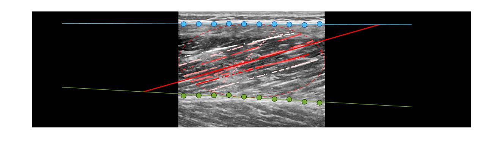

# TimTrack: A drift-free algorithm for estimating geometric muscle features from ultrasound images

This respository contains MATLAB-based code that can be used to estimate muscle fascicle length, muscle thickness and pennation angle from muscle ultrasound images. The so-called TimTrack-algorithm uses a combination of Frangi-type vessel enhancement filtering to highlight line-like structures and Hough transform to obtain the overall fascicle orientation.

This algorithm is described in more detail in a [bioRxiv pre-print](https://www.biorxiv.org/content/10.1101/2020.08.23.263574v2) and has been used to estimate the mechanical work done by muscle fascicles during cyclic contraction in a [peer-reviewed study](https://journals.biologists.com/jeb/article-abstract/224/9/jeb233965/237823/The-high-energetic-cost-of-rapid-force-development?redirectedFrom=fulltext).

## Overview
The main function is called **auto_ultrasound**, which requires a grayscale ultrasound image (*ultrasound_image*) and parameters (*parms*) as inputs and outputs geometric muscle features (*geofeatures*) and (optionally) aponeurosis vectors (*apovecs*). These inputs and outputs will be explained below. As an example, auto_ultrasound may be ran on an example processed image using default parameters by evaulating the script **example.m**. 

Before **auto_ultrasound** can be ran on any new ultrasound image, the raw image needs to be processed and parameters may need to be adjusted. An example of how to process a raw image is shown in **process_ultrasound_image**, and example of how the parameters can be adjusted is shown in the live script **adjust_ultrasound_parameters**. 

## Main function: auto_ultrasound.m
[geofeatures, apovecs] = auto_ultrasound(ultrasound_image,parms)

**Inputs**

* ultrasound_image: needs to be a m-by-n numeric array specifying grayscale intensities, saved in .mat format. Fascicle angle needs to be within the range 0-90 deg with the positive horinzontal, pointing to the right. Depending on your specific image, you may need to flip about the vertical axis. For an example of processing raw images (incl. flipping, reading, cutting, converting), see **process_ultrasound_image**.
* parms: struct specifying the parameters used in the algorithm, with fields fas and apo. For an example on how to adjust parameters, see the live script **adjust_ultrasound_parameters**.

**Outputs**

* geofeatures: struct containing geometric muscle features, including fascicle angle with the horizontal in degrees (*alpha*), superficial aponeurosis angle with horizontal in degrees (*betha*) and perpendicular distance between superficial- and deep aponeurosis in pixels (*thickness*). 
* apovecs: vectors containing the sampled points on the aponeurosis object, which may be post-hoc processed using **correct_aponeuroses**.

**Outputs may be used to determine pennation angle (phi) and fascicle length (faslen):**
* phi = alpha - betha;
* faslen = thickness ./ sind(phi);

## Core functions: filter_usimage and dohough

* *filter_usimage.m*: main filter function which calls on several Frangi filter functions created by Dirk-Jan Kroon (https://www.mathworks.com/matlabcentral/fileexchange/24409-hessian-based-frangi-vesselness-filter)

* *dohough.m*: executes MATLABs hough transform function (https://www.mathworks.com/help/images/ref/hough.html) and uses the median of the most frequently occuring angles in the image to estimate fascicle angle (i.e. with the horizontal)

## Parameters

Contains default parameters *parms.mat* and a script to create these *default_parms.m*

## Example images

Contains example data

*example_ultrasound_image*
* Muscle: Vastus Lateralis
* Ultrasound device: General Electric Logiq E9
* Facility: University of Calgary, Canada
* Investigator: Tim van der Zee

*example_ultrasound_image2*
* Muscle: Vastus Lateralis
* Ultrasound device: Telemed LVD8-4L65S-3
* Facility: University of Verona, Italy
* Investigator: Paolo Tecchio

*example_ultrasound_image3*
* Muscle: Gastrocnemius Medialis
* Ultrasound device: Telemed LVD8-4L65S-3
* Facility: University of Verona, Italy
* Investigator: Paolo Tecchio

*example_ultrasound_image4*
* Muscle: Gastrocnemius Lateralis
* Ultrasound device: General Electric Logiq E9
* Facility: University of Calgary, Canada
* Investigator: Tim van der Zee

For questions, please email me: tim.vanderzee@ucalgary.ca
